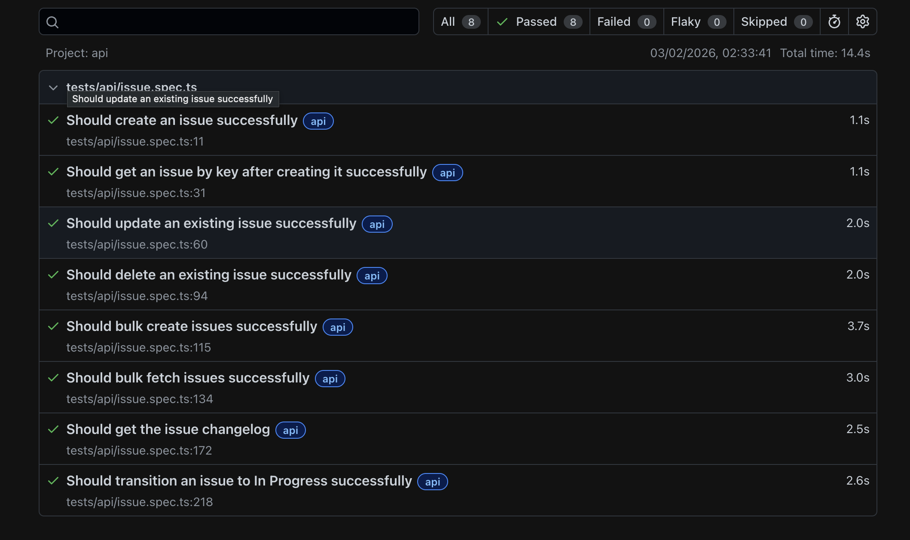
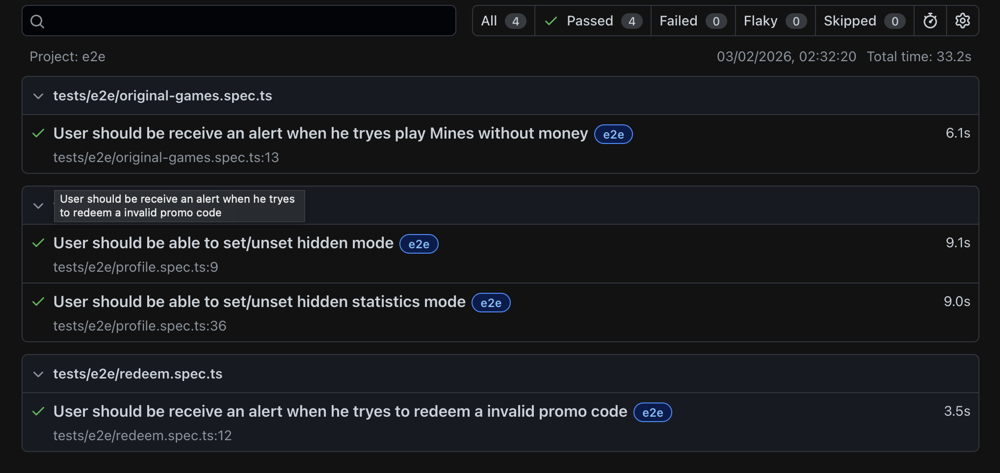
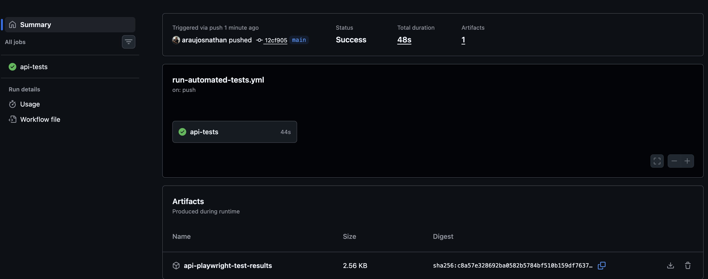

# Automation Testing

End-to-end and API Test automation using Playwright with TypeScript.

---

## Overview

This project provides automated testing for E2E and API Testing. 
The framework is built with:

- **Playwright** - Modern web testing framework
- **TypeScript** - Type-safe test development
- **Page Object Model** - Maintainable test architecture
- **Global Authentication** - Fast, reusable authentication

---

## Architecture

### Page Object Model (POM)

The project uses a **BasePage inheritance pattern** where all page objects inherit from a common base class.

All page objects extend `BasePage`:

```typescript
export class HomePage extends BasePage {
    constructor(page: Page) {
        super(page);
    }
    
     async waitForHomeBeDisplayed(){}
}
```

### Service Layer

#### profileApi
**`profile-api.ts`** - Provides typed API methods for test data setup and cleanup:
- **Uses page.context()** - Automatically gets Cookies for authentication
- **Typed methods** - Type-safe API calls with proper request/response handling
- **Test data management** - Hide Mode or Statistics

```typescript
// Available in tests via fixture
test('User should be able to set/unset hidden mode', async ({ profileApi }) => {
    test.info().annotations.push({ type: 'TestCaseId', description: '002' });
    await profileApi.setHiddenMode(false);
});
```

#### apiClient
- **Authentication and HTTP Context**: Creates an APIRequestContext with authentication headers (Authorization: Basic) and a base URL. Ensures all requests through the client are properly authenticated and configured.

- **Issue CRUD**
    - createIssue(issuePayload): create a single issue.

    - bulkCreateIssue(issuesPayload): create multiple issues at once.

    - getIssue(issueKey): fetch a specific issue.

    - getBulkIssue(issueKeys): fetch multiple issues.

    - updateIssue(issueKey, fields): update issue fields.

    - deleteIssue(issueKey): delete an issue.

- **Workflow and Transitions**:
    - getTransitions(issueKey): get possible issue transitions.
    - doTransition(issueKey, transitionId): perform a transition on an issue.

- **History and Audit**

    - getIssueChangeLog(issueKey): fetch the changelog for an issue to validate field changes and transitions.

- **Automated Testing Support**: Allows tests to create, update, and validate issues programmatically. Centralizes authentication and configuration, avoiding repetitive setup in multiple tests.

### Fixtures Pattern

**`fixtures.ts`** - Provides dependency injection for page objects and services:

```typescript
export const test = base.extend<CustomFixtures>({
    homePage: async ({ page }, use) => {
        await use(new HomePage(page));
    },
    signInPage: async ({ page }, use) => {
        await use(new SignInPage(page));
    },
    // ... more fixtures
});
```

Tests automatically receive initialized page objects:

```typescript
test('My test', async ({ homePage, signInPage }) => {
    // homePage and questionPage are ready to use!
});
```

### Constants & Enums

**Best Practice:** Use TypeScript enums and constants for reusable values:

```typescript
// Example: Menu options enum
export enum OriginalGames {
    Dice = 'Dice',
    Crash = 'Crash',
    Mines = 'Mines',
}


// Usage in tests
 await leftSideMenuPage.openOriginalGame(OriginalGames.Mines);
```

### Interfaces

**`tests/support/interfaces/`** - TypeScript interfaces for type-safe Objects or API responses:

```typescript
// question.interface.ts
export interface UserCredentials {
    username: string;
    password: string;
}

// Usage in tests
async doLogin(UserCredentials: UserCredentials){
        await this.locators.formLogin.waitFor({state: 'visible'});
        await this.locators.usernameInput.fill(UserCredentials.username);
        await this.locators.passwordInput.fill(UserCredentials.password);
        await this.locators.startPlayingButton.click();
        
    }
```
---

## Getting Started

### Prerequisites

- **Node.js** (v18 or higher)
- **npm** or **yarn**

### Installation

1. **Clone the repository**
   ```
   git clone ...
   ```

2. **Install dependencies**
   ```bash
   npm install
   ```

3. **Install Playwright browsers**
   ```bash
   npx playwright install chromium
   ```

### Environment Configuration

Create a `.env` file in the project root:

```env
BASE_URL=https://your-app-url.com
USERNAME=your-email@domain.com
PASSWORD=myour-password
API_BASE_URL=https://your-api-url.com 
JIRA_AUTH_TOKEN=jira-token
JIRA_BASE_URL=jira-base-url
```

**Important:** Never commit `.env` file to git! It's already in `.gitignore`.

---

## Code Quality & Linting

### ESLint Setup

This project uses **ESLint** with Playwright-specific rules to ensure code quality and catch common issues.

#### Installed Plugins

- **eslint** - Core linting engine
- **@typescript-eslint** - TypeScript support
- **eslint-plugin-playwright** - Playwright best practices
- **custom/require-assertion** - Custom rule to enforce assertions in tests

#### ESLint Configuration

Uses **ESLint 9.x flat config** (`eslint.config.mjs`):
-  No `.eslintignore` file needed
-  All ignores defined in config
-  Custom rules support
-  Multiple file pattern overrides

```javascript
// eslint.config.mjs structure
export default [
  { files: ['**/*.ts'], rules: { /* all files */ } },
  { files: ['**/*.spec.ts'], rules: { /* test files only */ } },
  { files: ['**/enum/*.ts'], rules: { /* enum files only */ } },
  { ignores: ['node_modules/', 'test-results/', 'eslint-rules/'] }
];
```

#### Running ESLint

```bash
# Check for linting errors
npm run lint

# Auto-fix linting errors
npm run lint:fix

# Type checking (no emit)
npm run type-check
```

#### Key Rules Enforced

 **Playwright Best Practices:**
- No focused tests (`test.only`) in commits
- Prefer web-first assertions (`toBeVisible()` over `toBeTruthy()`)
- Avoid `page.waitForTimeout()` - use specific waits
- No element handles - use Locators instead
- No `page.evaluate()` for simple actions
- **Test assertions auto-recognition** - Methods starting with `verify*`, `assert*`, `expect*`, or `waitFor*` are recognized as containing assertions

 **TypeScript Best Practices:**
- Explicit types where needed
- No unused variables
- Consistent code style
- No non-null assertions (`!`) - use proper validation instead

 **General Best Practices:**
- Use `const` over `let` where possible
- Strict equality (`===` instead of `==`)
- Always use curly braces

#### Custom Assertion Detection Rule

**ENFORCED: Every Test Must Have Assertions**

This project uses a **custom ESLint rule** (`custom/require-assertion`) that automatically detects assertion methods in tests. The rule scans for:
- `expect()` - Explicit Playwright assertions
- `verify*` - Page object verification methods  
- `assert*` - Page object assertion methods
- `check*` - Page object check methods
- `waitFor*` - Page object wait methods with implicit validation

```javascript
// In eslint.config.mjs
{
  files: ['**/*.spec.ts', '**/*.test.ts'],
  rules: {
    'custom/require-assertion': 'error',
  }
}
```

**Custom Rule Location:**
- `eslint-rules/require-assertion.js` - Custom rule implementation
- Uses regex: `/(expect|verify|assert|check|waitFor)/i`
- Scans all function calls inside test blocks

**Benefits:**
-  **No manual disable comments needed** - automatically recognizes assertion patterns
-  **Catches missing validations** - prevents useless tests
-  **Flexible naming** - any method with verify/assert/check/waitFor is recognized
-  **Build fails** if test has no assertions

**Best Practice - Method Naming:**
- `verify*` - Contains explicit `expect()` assertions
- `assert*` - Contains explicit `expect()` assertions  
- `check*` - Contains validation logic
- `waitFor*` - Contains implicit validation (element exists/visible)
- Other names - Actions only (clicks, fills, selects)

#### VS Code Integration

Install recommended extensions:
1. **ESLint** (`dbaeumer.vscode-eslint`)
2. **Playwright Test** (`ms-playwright.playwright`)

ESLint will:
- Auto-fix on save
- Show errors inline
- Highlight issues in real-time

#### CI/CD Integration

Add to your CI pipeline:
```yaml
- name: Lint Tests
  run: npm run lint

- name: Type Check
  run: npm run type-check
```

---

## Running Tests

### Run E2E Tests
```bash
npx playwright test --project=e2e
```

### Run API Tests
```bash
npx playwright test --project=api
```

### Run in UI Mode (Interactive)
```bash
npx playwright test --ui --project=api
```

### View Test Report
```bash
npx playwright show-report
```
---

## Authentication Setup

### Global Authentication with Playwright Projects

This project uses **global setup** to authenticate **once** before all e2e tests run, significantly improving test execution speed.

#### How It Works

1. **Global Setup** (`tests/support/global-setup.ts`):
   - Runs as a Playwright "setup" project
   - Uses `signInPage.doLogin()` to authenticate
   - Saves session state to `.auth/user.json`
   - Supports multiple users for different test scenarios

2. **Playwright Projects** (`playwright.config.ts`):
   ```typescript
   projects: [
     {
      name: 'e2e',
      testDir: './tests/e2e',
      use: {
        ...devices['Desktop Chrome'],
        storageState: '.auth/user.json',
        baseURL: process.env.BASE_URL,
      },
    },
   ]
   ```

3. **Tests** - Already authenticated when they start!
   ```typescript
   test.beforeEach(async ({ page, homePage }) => {
     await page.goto(process.env.BASE_URL!);
     // Already logged in - no authentication needed!
   });
   ```

#### Benefits

 **Faster execution** - Authenticate once, not per test  
 **Less flaky** - Fewer authentication requests  
 **Parallel tests** - All tests share authenticated state  
 **Cleaner code** - No login logic in test files  

---
API Tests


E2E Tests


CI (Workflow - GithAction) - Only for API becase application is not available for the country (Needs to use VPN in that case.)

[Link to GitHub Action](https://github.com/araujosnathan/playwright-automation-testing/actions)



---
## Analyses
[Key Areas](/key-areas.md)

[Complex Scenario](/complex-scenario.md)

---
Thank you!
